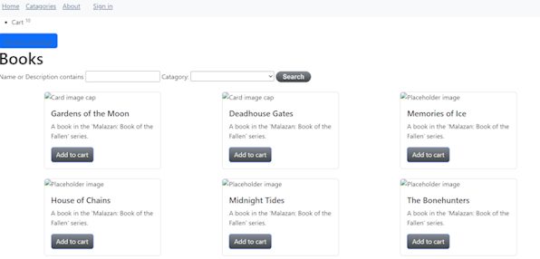
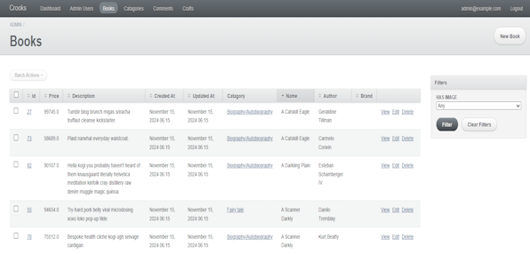

# Project Purpose

In a full stack development course in college, I had made a fully functional eCommerce website using Ruby on Rails.
The purpose of this was to develop a website containing a CMS using Rails gems. Developed entirely by me, the featured website focused on a fictional book store, named Crooks, that sells books at neigh unattainable prices.

Intentionally, this website was created with ease of management in mind, hence the CMS aspect. An admin page is featured in which the store owner could add affect the databases that stored all book data, prices, and associated images. 

This admin page was done with the use of a ruby gem. To set it up, all I needed was to add in my database info. 
From there, I am able to add, edit, view, and delete or add CRUD features. There is a admin login page implamented within this gem as well to ensure security.
 The image option in the admin pages directly linked to google cloud, which as my first attempt at cloud storage within code, took a while to implament.

Included within the pages of the project was a payment option in Stripe. Here customers are able to insert their 
credit card information, along with form validation to ensure that the information is valid.

# What I learned
During the process of creating a mock ecommerce website, I learned about the efficiencies of Ruby on Rails in the ecommerce space. The Ruby gems I used made implamenting the features I wanted very simple. An admin gem created the basis of an admin system, that I could modify to my hearts content. A google cloud gem and some research on the google cloud half of this taught me how to combine code and cloud storage. I was able to store local images into a free google cloud server. The database management of this project helped me understand just how vast a simple websites database can be. Requirements for this project involved having at least 5000 entries, which was made simple using the faker gem in Ruby. Last on the list was web hosting, in which I used Ubuntu to host it through Linux.

🏶

