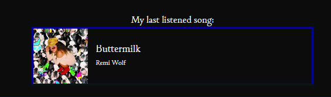

# Project Purpose

This website, "Midnight Tides", was built with the intentions of having a personal digital playground. After beginning to follow a movement of technical people online creating their own sites as a means of personalizing the internet again, I began to pursue this as a passion project. Utilizing Astro as its popular among the crowd, and with website inspiration from exploration of the aforementioned movement. Credits for inspiration are listed here: [moonlight computer](https://moonlight.computer/links/), [my friend Luc](https://lovepill.moe/) and [James Coffee Blog](https://jamesg.blog/2024/02/19/personal-website-ideas).

# Creation Process

This project was my first time using Astro, Vercel, and MDX. Starting off this project, I had completed [Astro's tutorial](https://docs.astro.build/en/tutorial/0-introduction/), creating a blog as I learned of Astro's tools. Then using the results of the tutorial, the basis of "Midnight Tides" was created. There was a blog section, a introduction of who I am, and a social media link page. Wrote up a few blog posts, when I ran into a problem with the way images were done in markdown. Astro's Image component is quite useful, but the constraints of markdown did not let me change the size of photos used within blog posts, which led to me learning MDX. 

My next step was to host the website. I had my eyes on Vercel, from a friends reccomendation. Vercel integration is officially supported within Astro's documentation, making the process relatively worry free. All that I needed to do on my end, was connect my GitHub repository to vercel and change a few lines within my astro.config.ts file.

After hosting on Vercel, my next thought was to add last.fm integration. As music is something I'm passionate about, a showing of what I'm listening to on the site was a fun decision for myself. With previous experience using last.fm's API, I added a now listening section to my site. There is a call made to my last.fm account, which itself has integration with Spotify, gathering the data within a component and displays it on the home page. 

When first added, this now listening box worked fantastic on my local environment but on the Vercel deployment it only displayed the song I listened to on the latest deployment. It was because of Astro's prerendering. Bashing my head against this for a bit too long, I eventually added one simple line to resolve the whole mess.

`export const prerender = false;`

And that was it! Now my music currently playing changed as I listened to new songs. Simple as that, coding problems can be oh so fun to deal with.

The rest of the site had nowhere near as much trouble. There's two pages dedicated to cool quotes and movies ratings. A now page, which acts similarly to a about page, but is more about what I am doing as opposed to who I am. The most recent addition is pagination, which with how often I post new blogs was very very needed.
